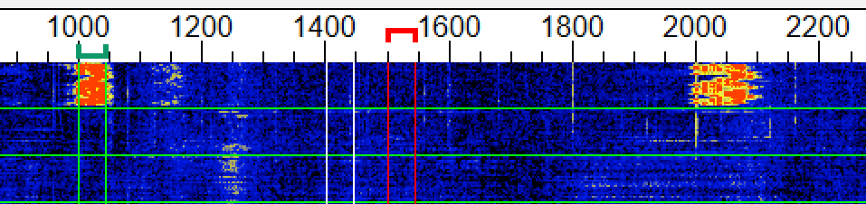

# CardFTx
A FT4/FT8 client on Cardputer.

## Installation

- **Board:** M5Stack  
- **Libraries:** M5Cardputer (and all required dependencies)

## Setting

- **Partition Scheme:** 
- **Flash Size:** 8MB(64Mb)  
- **PSRAM:** QSPI PSRAM  

## Mode

- 

## Notice

## Acknowledgements

The FT8 core functionality of this project is made possible thanks to:  
ft8_lib - A robust FT8 library for microcontrollers developed by kgoba.  